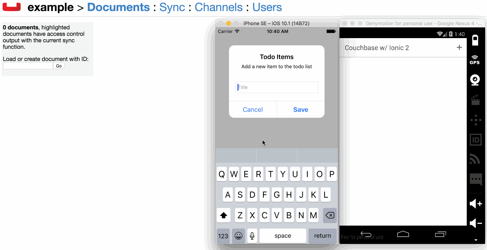

# Couchbase Ionic 2 Sample Application

A sample application built with Ionic 2 that demonstrates Couchbase data synchronization and management using the Couchbase Apache Cordova plugin and Couchbase JavaScript wrapper for the Apache Cordova plugin.



## Requirements

To run this project you need the following:

* Node.js 4.0+
* Ionic Framework 2.0+

This is an Ionic 2 project that uses Angular 2 and TypeScript.  All dependencies are managed using NPM which is included in a Node.js installation.

## Installation and Configuration

The project listed on GitHub excludes all the dependencies required for building an iOS and Android application.  This is to keep the repository lightweight.  To build for Android and iOS, download the repository and execute the following:

```
npm install
ionic state restore
```

The above commands will install all the Node Package Manager (NPM) dependencies and configure all the Apache Cordova plugins and platforms.

To build and run the application, execute the following:

```
ionic emulate [platform]
```

Remember to swap out `[platform]` with your desired build platform.  iOS requires a Mac with Xcode installed.

## Couchbase Sync Gateway

The project is configured to handle data synchronization, but doesn't require it.  If you wish to test out synchronization, see the included **sync-gateway-config.json** file.  This file must be run using Couchbase Sync Gateway.

After running Sync Gateway, alter the hostname found in the project's **src/providers/couchbase-provider.ts** file to reflect that of your Sync Gateway server.

## Resources

Couchbase - [http://www.couchbase.com](http://www.couchbase.com)

Couchbase Apache Cordova Plugin - [https://github.com/couchbaselabs/Couchbase-Lite-PhoneGap-Plugin](https://github.com/couchbaselabs/Couchbase-Lite-PhoneGap-Plugin)

Couchbase Cordova JavaScript Wrapper - [https://github.com/couchbaselabs/cordova-couchbase](https://github.com/couchbaselabs/cordova-couchbase)

Ionic Framework - [http://www.ionicframework.com](http://www.ionicframework.com)